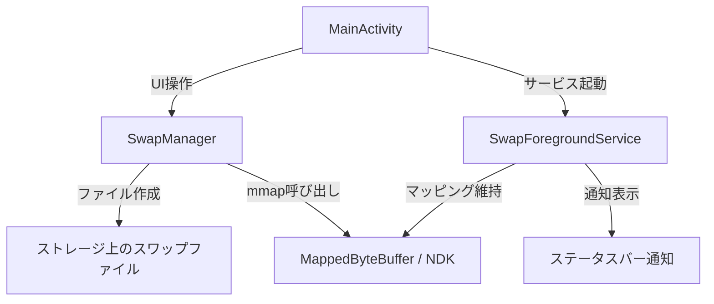

# MySwapApp — Root不要スワップアプリ開発計画

## 概要

Android端末でroot化不要の仮想メモリ（スワップ）を作成・管理するアプリを開発する。
「SWAP – No ROOT」と同等の機能を、自分のコードで実現する。

## アーキテクチャ

## Phase 1: UI + 基本構造（今回実装）

### 画面デザイン
- ダークテーマベースのモダンUI
- メモリ状況のリアルタイム表示（使用量/合計）
- スワップサイズ入力スライダー（128MB〜2048MB）
- 3つのメインボタン：
  - **CREATE SWAP** — スワップ作成
  - **DELETE SWAP** — スワップ削除
  - **STATUS** — 現在の状態確認
- ステータス表示エリア（有効/無効、サイズ）

### 変更ファイル一覧

#### [MODIFY] [activity_main.xml](file:///D:/USERFILES/MyDocuments/Android/app/src/main/res/layout/activity_main.xml)
- Hello World を削除し、スワップ管理UIに置き換え
- サイズ入力（SeekBar + 数値表示）
- CREATE / DELETE / STATUS ボタン
- メモリ情報テキスト、ステータス表示

#### [MODIFY] [MainActivity.kt](file:///D:/USERFILES/MyDocuments/Android/app/src/main/java/com/example/myswapapp/MainActivity.kt)
- UI操作のイベントハンドリング
- SwapManager の呼び出し
- メモリ情報の取得・表示
- Foreground Service の起動/停止

#### [NEW] SwapManager.kt
- スワップファイルの作成（`RandomAccessFile` + `FileChannel.map`）
- `MappedByteBuffer` によるメモリマッピング維持
- スワップファイルの削除
- ステータス確認

#### [NEW] SwapForegroundService.kt
- バックグラウンドでマッピングを維持するための Foreground Service
- ステータスバー通知でスワップ状態を表示
- アプリを閉じてもスワップを維持

#### [MODIFY] [AndroidManifest.xml](file:///D:/USERFILES/MyDocuments/Android/app/src/main/AndroidManifest.xml)
- `FOREGROUND_SERVICE` パーミッション追加
- `POST_NOTIFICATIONS` パーミッション追加（Android 13+）
- SwapForegroundService の登録

#### [MODIFY] [colors.xml](file:///D:/USERFILES/MyDocuments/Android/app/src/main/res/values/colors.xml)
- アプリのカラーパレット定義

#### [MODIFY] [themes.xml](file:///D:/USERFILES/MyDocuments/Android/app/src/main/res/values/themes.xml)
- Material3 ダークテーマのカスタマイズ

#### [MODIFY] [strings.xml](file:///D:/USERFILES/MyDocuments/Android/app/src/main/res/values/strings.xml)
- UI文字列の定義

## Phase 2: NDK拡張（必要に応じて後で）

> [!NOTE]
> Phase 1 では Java/Kotlin の `MappedByteBuffer`（`FileChannel.map()`）を使用する。
> これは内部的に `mmap()` システムコールを呼ぶため、NDK/C言語なしで同等の効果が得られる。
> パフォーマンスに問題があればPhase 2でNDK版に切り替える。

## 技術的なポイント

### なぜ `MappedByteBuffer` で効くのか
1. `FileChannel.map()` は内部的に `mmap()` を呼ぶ
2. カーネルがページテーブルにマッピングを登録
3. メモリプレッシャー時、カーネルはこのマップドページを「ファイルバック」として認識
4. OOM Killerの代わりに、マップドページをディスクに書き戻すことで物理RAM を解放
5. 結果として、他のアプリのバックグラウンド保持率が向上

### Foreground Service が必要な理由
- アプリがバックグラウンドに回ると、Android がプロセスを kill する可能性がある
- `MappedByteBuffer` の参照が消えるとマッピングも解除される
- Foreground Service で常駐させることで、マッピングを維持する

## 検証方法

### ビルド確認
- Android Studio で Build > Make Project が成功すること
- エミュレータまたは実機で起動確認

### 機能確認
- CREATE SWAP でファイルが作成されること
- スワップ有効中にステータスバー通知が表示されること
- DELETE SWAP でファイルが削除されること
- アプリを閉じてもサービスが維持されること
